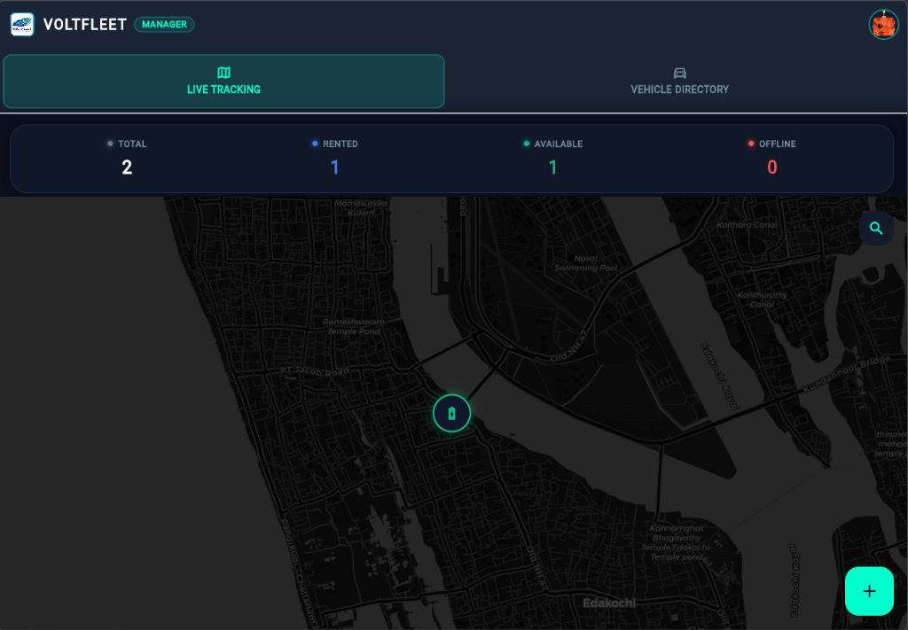
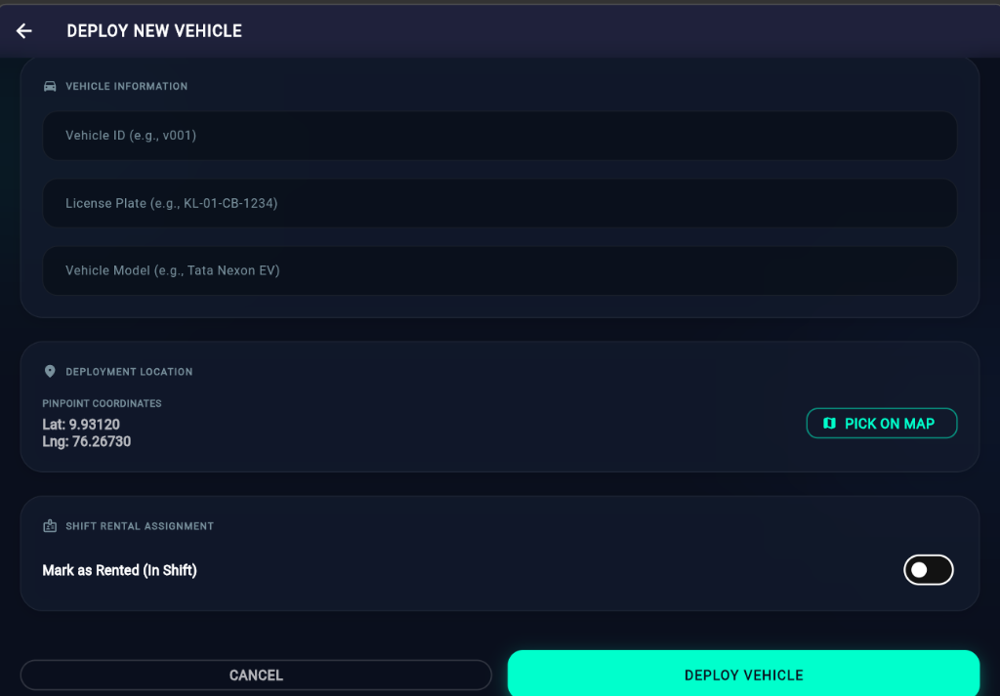
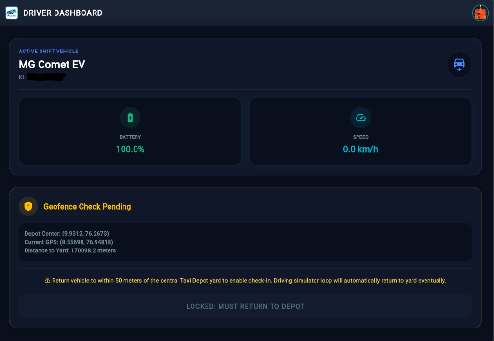

# VoltFleet EV Fleet Management App
### ⚡ EV Fleet Management and Telemetry System

Welcome to **VoltFleet**, a comprehensive EV Fleet Management and real-time Telemetry tracking application built using Flutter. 

This application is designed to solve real-world logistical challenges in electric vehicle fleet management. It features a dual-role interface customized for fleet managers and vehicle drivers. The project focuses on real-time data synchronization, dynamic status tracking, and precise map overlays to simulate and manage an active commercial EV fleet.

---

## 🚗 Project Specifications & Architecture

This app is structured into a secure, role-based platform split between **Managers** (who track the fleet and deploy vehicles) and **Drivers** (who check out vehicles and log trips).

### 1. Technology Stack
*   **Framework:** Flutter (Dart) — Multi-platform support (compiled for Web and Android).
*   **Database:** Cloud Firestore (explicitly bound to the named database ID `default` in our Firebase project configuration to ensure reliable connection and state preservation).
*   **Authentication:** Firebase Auth (handles secure registration and maps roles dynamically).
*   **Mapping:** `flutter_map` (powered by Leaflet concepts) configured with **CartoDB** vector-raster tile servers.

### 2. Premium Design System
Instead of using generic default layouts, the app utilizes a custom visual engine (`theme_provider.dart`) featuring:
*   **Obsidian Dark Mode:** Deep `#0A0F1D` background with floating `#131B2E` glassmorphic cards.
*   **Ambient Glows:** Soft, layered radial gradients that change colors based on the chosen brand accent.
*   **Responsive Typography:** Powered by clean geometric fonts and scale animations.

---

## ⚡ Core Features (How it works)

### 🗺️ Live Map Tracking
We display a real-time tracking map using **CartoDB's native dark/light maps** (`dark_all` and `light_all`) to match the active application theme.
*   Supports **CORS natively**, preventing security errors when running on Flutter Web with the CanvasKit renderer.
*   Automatically toggles tile style colors when the user switches themes.

### 📋 Full-Page Vehicle Deployment (`lib/screens/add_vehicle_screen.dart`)
We provide a dedicated, spacious **full-page screen** for vehicle deployment.
*   Includes validation for standard Indian Driver's License formats (e.g., `KL-01-2022-1234567`).
*   Validates 10-digit mobile phone inputs to ensure data integrity in Firestore.
*   Pushes dynamic coordinate points directly from the tracking map when you tap "Deploy" at a pinned location.

### 👤 Role-Based Authorization
On login, the app reads the authenticated user's ID and queries the Firestore collections (`manager` or `driver`) to load the correct interface. Session state is preserved on app reload so users remain securely logged in.

### 📲 Driver Trip Telemetry
Drivers can check out available vehicles, log speeds, monitor State of Charge (SoC) percentages, and end active trips, which returns the vehicle back into the available pool.

---

## 💡 Technical Highlights & Architecture Design
1.  **Real-Time Data Streams**: Leverages reactive Dart streams and StreamBuilders to sync battery levels, speeds, and geographic coordinates immediately between drivers and managers.
2.  **Clean & Modulated UI Layers**: Implements decoupled screens, services, and theme states, reducing codebase bloat and allowing easy layout adjustments.
3.  **Cross-Origin Map Compatibility**: Designed to load map tiles flawlessly across mobile and web builds by integrating specialized network providers with native CORS support.

---

## 📸 Screenshots & Demos

Below are the screenshots of the system in action. *(Create a `screenshots/` folder in your project root and drop your screenshots there with the matching file names to display them here!)*

| Login Screen | Manager Dashboard (Map) |
|:---:|:---:|
|  |  |

| Deploy New Vehicle Screen | Driver Checkout & Telemetry |
|:---:|:---:|
|  |  |

---

## 🚀 How to Run (Read carefully!)

Do **NOT** try running `flutter run` in the root folder of this repository, or you will get a `No pubspec.yaml file found` error. 

Follow these steps in your terminal:

```bash
# 1. Navigate into the actual Flutter project folder
cd ev_fleet_app

# 2. Get dependencies
flutter pub get

# 3. Launch the app on your emulator, device, or browser
flutter run
```
