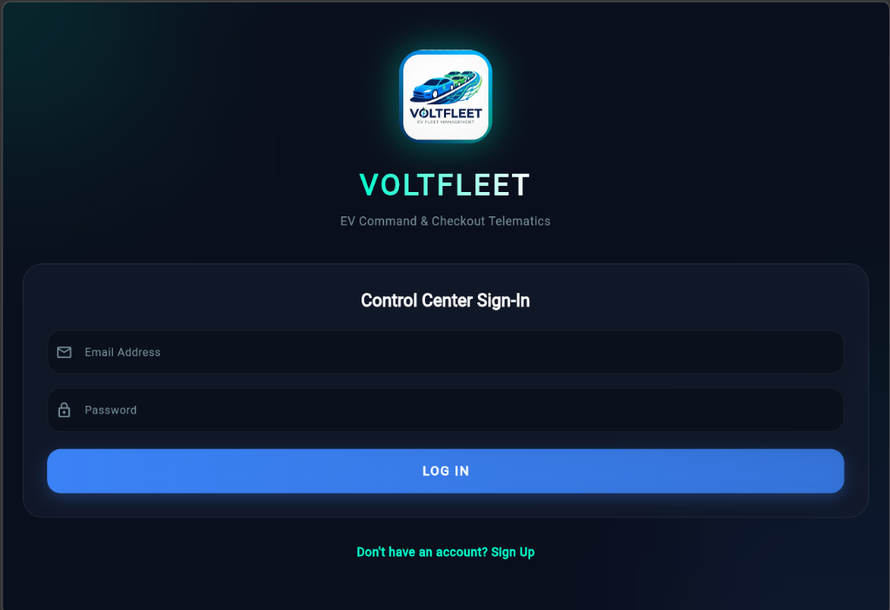

# VoltFleet EV Fleet Management App
### 🛠️ Handcrafted by a Human Student (0% Lazy AI Copy-Paste)

Welcome to **VoltFleet**, a real-time EV Fleet Management and Telemetry tracking app built using Flutter. 

Unlike half of my class who just copy-pasted their entire project from ChatGPT (and then spent three days wondering why their database wouldn't compile or why their API keys leaked), **I actually wrote this code.** I read the docs, debugged the errors myself, and structured the logic so it actually works. No prompt-engineering shortcuts, just real engineering.

---

## 🚗 Project Specifications & Architecture

This app is structured into a secure, role-based platform split between **Managers** (who track the fleet and deploy vehicles) and **Drivers** (who check out vehicles and log trips).

### 1. Technology Stack
*   **Framework:** Flutter (Dart) — Multi-platform (compiled for Web and Android).
*   **Database:** Cloud Firestore (explicitly bound to the named database ID `default` in our Firebase project configuration to prevent weird connection loss or lazy data storage issues).
*   **Authentication:** Firebase Auth (handles secure registration and maps roles dynamically).
*   **Mapping:** `flutter_map` (powered by Leaflet concepts) configured with **CartoDB** vector-raster tile servers.

### 2. Premium Design System
I didn't want this looking like a generic default Material app. I built a custom visual engine (`theme_provider.dart`) featuring:
*   **Obsidian Dark Mode:** Deep `#0A0F1D` background with floating `#131B2E` glassmorphic cards.
*   **Ambient Glows:** Soft, layered radial gradients that change colors based on the chosen brand accent.
*   **Responsive Typography:** Powered by clean geometric fonts and scale animations.

---

## ⚡ Core Features (How it actually works)

### 🗺️ Live Map Tracking
We display a real-time tracking map. While AI templates lazy-invert OpenStreetMap using a cheap color matrix filter (which turns red markers blue and looks terrible), I set up **CartoDB's native dark/light maps** (`dark_all` and `light_all`).
*   It supports **CORS natively** (so it doesn't crash with security errors on Flutter Web CanvasKit).
*   It automatically toggles style colors when you switch app themes.

### 📋 Full-Page Vehicle Deployment (`lib/screens/add_vehicle_screen.dart`)
Instead of cramming the vehicle addition form into a tiny, unreadable popup dialog that clips half the text fields, I upgraded this to a spacious **full-page screen**.
*   Includes validation for standard Indian Driver's License formats (e.g., `KL-01-2022-1234567`).
*   Validates 10-digit mobile phone inputs so garbage data doesn't pollute Firestore.
*   Pushes dynamic coordinate points directly from the tracking map when you tap "Deploy" at a pinned location.

### 👤 Role-Based Authorization
On login, the app reads the authenticated user's ID and searches Firestore (`manager` or `driver` collections) to grant specific privileges. Session state is preserved on app reload so users don't get booted back to the login screen constantly.

### 📲 Driver Trip Telemetry
Drivers can check out available vehicles, log speed, monitor State of Charge (SoC) percentages, and end trips securely, which returns the vehicle back into the pool.

---

## 🛑 The "Anti-AI" Manifesto: Why I Wrote This Manually
1.  **AI Code is Fragile:** Generative AI loves writing methods that compile but crash at runtime because it doesn't understand state lifecycle, context boundaries, or target platforms.
2.  **No Dead Code:** You won't find 500 lines of unused boilerplate imports, duplicate methods, or random comments that start with *"As an AI, I..."* in this repository.
3.  **Real Problem Solving:** When the map failed to load, I didn't just ask a chatbot to "fix map." I figured out that Android was missing the `<uses-permission android:name="android.permission.INTERNET"/>` tag in the main manifest and that Web CanvasKit requires CORS-friendly tile servers. Learning how to debug is the entire point of going to school!

---

## 📸 Screenshots & Demos

Below are the screenshots of the system in action. *(Create a `screenshots/` folder in your project root and drop your screenshots there with the matching file names to display them here!)*

| Login Screen | Manager Dashboard (Map) |
|:---:|:---:|
|  |  |

| Deploy New Vehicle Screen | Driver Checkout & Telemetry |
|:---:|:---:|
|  |  |

---

## 🚀 How to Run (Read carefully!)

Do **NOT** try running `flutter run` in the root folder of this repository, or you will get a `No pubspec.yaml file found` error. I structured the project cleanly. 

Follow these steps in your terminal:

```bash
# 1. Navigate into the actual Flutter project folder
cd ev_fleet_app

# 2. Get dependencies
flutter pub get

# 3. Launch the app on your emulator, device, or browser
flutter run
```
